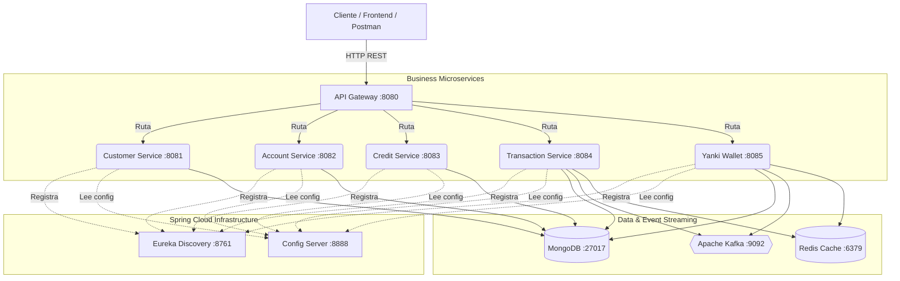
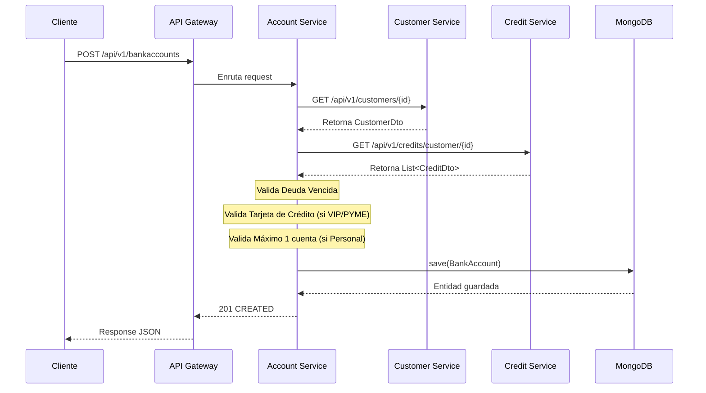
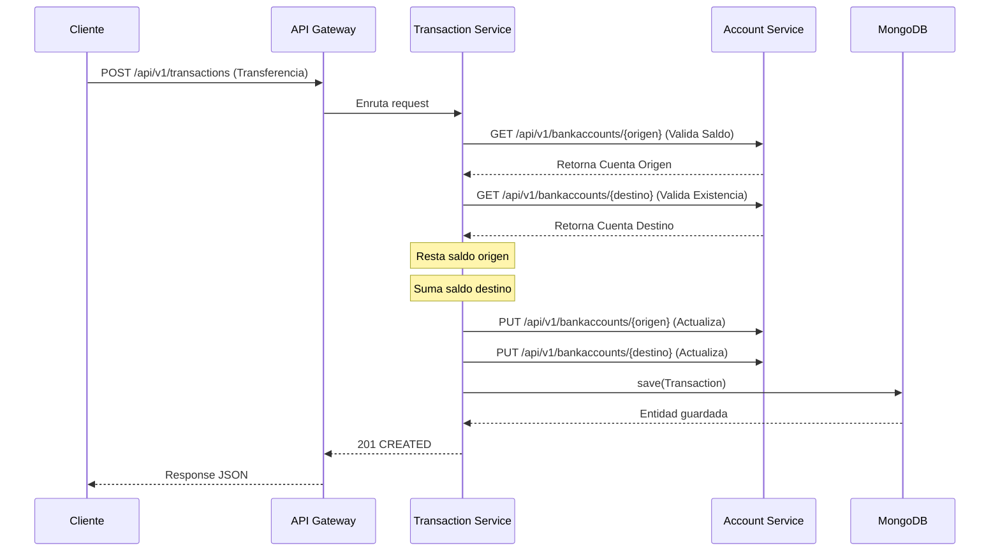

# 🏦 Proyecto Bancario NTT - Arquitectura de Microservicios Reactivos

Este proyecto es una solución bancaria basada en Java 17, Spring Boot 3.x y programación reactiva (WebFlux). Implementa patrones de microservicios robustos.

## 🏗️ Arquitectura del Sistema



## 🔄 Diagramas de Secuencia

### 1. Apertura de Cuenta Pasiva con Validación


### 2. Transferencia a Terceros (Saga Básica)


## 🚀 Cómo ejecutar el proyecto

1. **Levantar Infraestructura Base** (MongoDB, Redis, Kafka):
   ```bash
   docker-compose up -d
   ```

2. **Levantar Microservicios** (Orden recomendado):
   - `config-server` (mvn spring-boot:run)
   - `eureka-server` (mvn spring-boot:run)
   - `customer-service`, `account-service`, `credit-service`
   - `transaction-service`, `yanki-service`
   - `api-gateway`

3. **Acceder a Swagger (OpenAPI)**:
   Puedes documentarte interactuando con los endpoints a través del Gateway o directamente:
   - `http://localhost:8081/swagger-ui.html`

## 📦 Repositorios Git Independientes
Los microservicios ya tienen su repositorio local inicializado (`git init`). 
Agrega tus remotos (`git remote add origin URL`) y haz `git push`.
